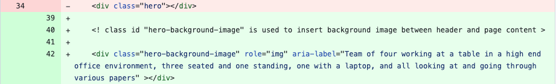
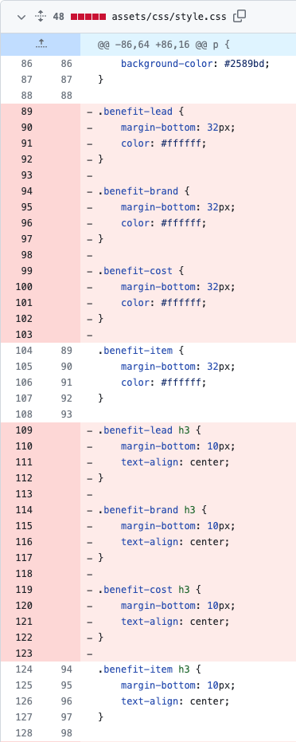
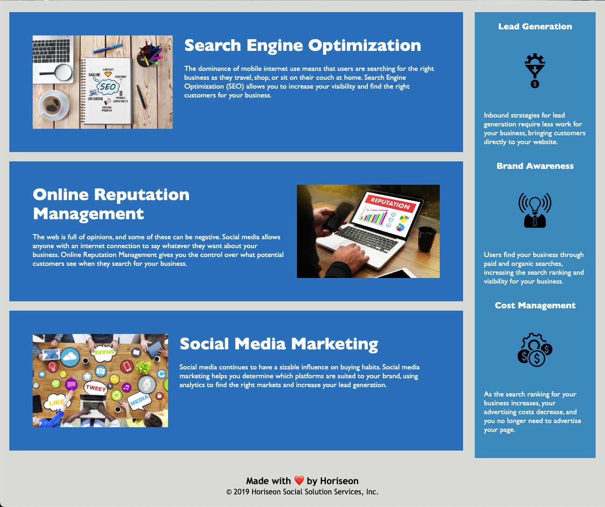

# Horiseon Code Refactor

## Description 

For this project, I was tasked to research accessibility standards and apply necessary or desired changes to the Horiseon website to better meet those standards, both to provide accessibilty to customers as well as to improve search engine optimization (SEO).

While completing the above work, I could also take the opportunity to follow the "Scout Rule" and make the code cleaner and better organized than when I found it.

I researched accessiblity standards and learned that one key accessibilty concern is text descriptions for any images displayed on the web page. Complete and expressive descriptions are preferred, and I added these descriptions in alt text for all images. I found that the web page includes a background image inserted via CSS, which does not allow for standard alt text. Instead, in addtion to the class ID, I had to add the attribute role="img", as well as an ARIA label, short for Accessible Rich Internet Applications. With this technique, assistive technologies, such as screen readers, can be provided with additional information about the purpose of HTML elements so tagged.

A code snippet showing the addition of the ARIA label is shown below.

Other page updates involved clean-up and organization of the HTML and CSS code. I fixed a broken navigation link, reordered CSS items to match the HTML, and consolidated various CSS selectors. I also added detailed comments to both the HTML and CSS files to clarify functionality.

An example of CSS selector consolidation is shown below. Class IDs with identical formatting were replaced with a more generic class ID.

Notably, I learned that there are multiple ways to structure CSS tagging. Class IDs, standard semantic elements such as "main" and "aside", and combinations of both can direct formatting of various components in the web page. I chose to add semantic elements and then remove superfluous class IDs, but it is possible that one way or another might be the preferred standard for different developers or companies.

I deployed the application on [GitHub](https://github.com/) [Pages](https://pages.github.com/), and it can be found [here](https://d-a-v-i-d-w-r-i-g-h-t.github.io/horiseon-refactor/).

## Installation

N/A

## Usage 

A screenshot of the web page is provided below. 

Navigation links are at the top right and jump the user to the designated content sections using anchor tags. As the web page isn't very long, this functionality is easier to demonstrate if the user's browser window height is reduced.

Alternate text for web page images can be viewed by right-clicking on the desired image and selecting "Inspect".

## Credits

I learned about CSS Selectors from [W3schools](https://www.w3schools.in/), [CSS Selectors](https://www.w3schools.in/css3/selectors).

I learned about semantic elements from the [Semrush Blog](https://www.semrush.com/blog/), [Semantic HTML: What It Is and How to Use It Correctly](https://www.semrush.com/blog/semantic-html5-guide/).

I learned about image descriptions from [Perkins School for the Blind](https://www.perkins.org/), [How to Write Alt Text and Image Descriptions for the visually impaired](https://www.perkins.org/resource/how-write-alt-text-and-image-descriptions-visually-impaired/?gclid=Cj0KCQjw06-oBhC6ARIsAGuzdw2Q3-ZpaKBjylgurELGWHtC1TeAx5Q_9LhN32vlC5OewXqIoyc9_VoaAggvEALw_wcB).

I learned about adding alternate text to a CSS-inserted background image from [CanAdapt](https://www.davidmacd.com/), [Alternate text for background images](https://www.davidmacd.com/blog/alternate-text-for-css-background-images.html).

The template for this README file was provided by [edX Boot Camps](https://www.edx.org/boot-camps).

## License

MIT License

Copyright (c) 2023 David Wright

Permission is hereby granted, free of charge, to any person obtaining a copy
of this software and associated documentation files (the "Software"), to deal
in the Software without restriction, including without limitation the rights
to use, copy, modify, merge, publish, distribute, sublicense, and/or sell
copies of the Software, and to permit persons to whom the Software is
furnished to do so, subject to the following conditions:

The above copyright notice and this permission notice shall be included in all
copies or substantial portions of the Software.

THE SOFTWARE IS PROVIDED "AS IS", WITHOUT WARRANTY OF ANY KIND, EXPRESS OR
IMPLIED, INCLUDING BUT NOT LIMITED TO THE WARRANTIES OF MERCHANTABILITY,
FITNESS FOR A PARTICULAR PURPOSE AND NONINFRINGEMENT. IN NO EVENT SHALL THE
AUTHORS OR COPYRIGHT HOLDERS BE LIABLE FOR ANY CLAIM, DAMAGES OR OTHER
LIABILITY, WHETHER IN AN ACTION OF CONTRACT, TORT OR OTHERWISE, ARISING FROM,
OUT OF OR IN CONNECTION WITH THE SOFTWARE OR THE USE OR OTHER DEALINGS IN THE
SOFTWARE.
